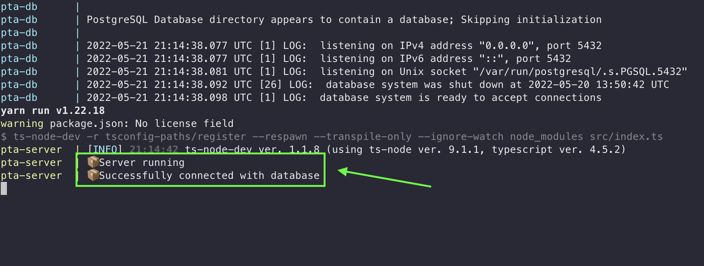
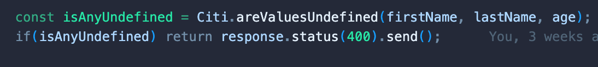
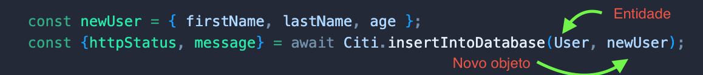
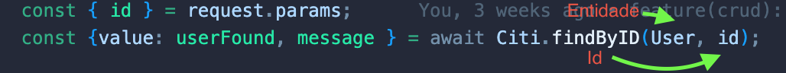
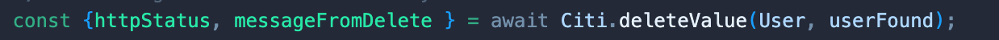
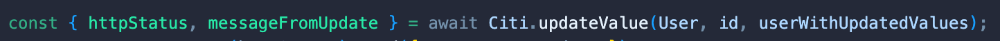
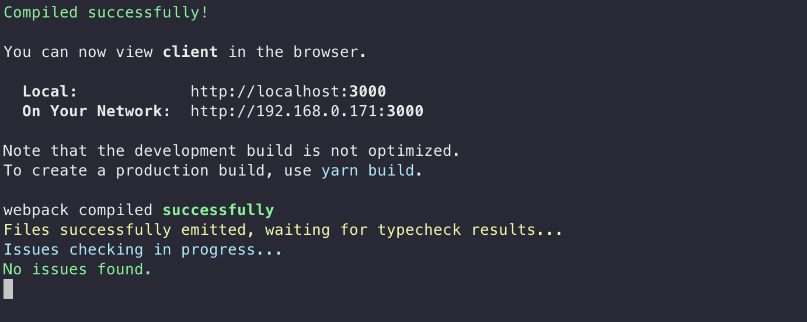

<br />
<p align="center">
  <a href="https://github.com/citi-onboarding/pta-boilerplate">
    
  </a>

  <h3 align="center">PTA — Squad Philip</h3>

  <p align="center">
    Repositório do desafio de desenvolvimento PTA 26.1 do CITi. O projeto é um sistema de gestão de biblioteca escolar composto por três frentes: um servidor Node.js (backend), uma interface web em Next.js e um aplicativo mobile em React Native com Expo.
    <br />
    <br />
    ·
    <a href="https://github.com/citi-onboarding/pta-boilerplate/issues">Report Bug</a>
    ·
    <a href="https://github.com/citi-onboarding/pta-boilerplate/issues">Request Feature</a>
  </p>
</p>

---

<!-- TABLE OF CONTENTS -->
<details open="open">
  <summary><h2 style="display: inline-block">Tabela de Conteúdo</h2></summary>
  <ol>
    <li><a href="#estrutura-do-projeto">Estrutura do Projeto</a></li>
    <li><a href="#server">Server</a></li>
    <ul>
      <li><a href="#how-to-install-server">Como Instalar</a></li>
      <li><a href="#how-to-run-server">Como Rodar</a></li>
      <li><a href="#citi-abstraction-documentation">Documentação da Abstração Citi</a></li>
      <ul>
        <li><a href="#are-values-undefined">areValuesUndefined</a></li>
        <li><a href="#insert-into-database">insertIntoDatabase</a></li>
        <li><a href="#get-all">getAll</a></li>
        <li><a href="#find-by-id">findById</a></li>
        <li><a href="#delete-value">deleteValue</a></li>
        <li><a href="#update-value">updateValue</a></li>
      </ul>
    </ul>
    <li><a href="#client">Client</a></li>
    <ul>
      <li><a href="#how-to-install-client">Como Instalar</a></li>
      <li><a href="#how-to-run-client">Como Rodar</a></li>
    </ul>
    <li><a href="#mobile">Mobile</a></li>
    <ul>
      <li><a href="#how-to-install-mobile">Como Instalar</a></li>
      <li><a href="#how-to-run-mobile">Como Rodar</a></li>
    </ul>
    <li><a href="#adicionar-dependencias">Adicionar Dependências</a></li>
    <li><a href="#contact">Contato</a></li>
  </ol>
</details>

---

## Estrutura do Projeto

<p align="center">
  
</p>

O projeto é um monorepo com três pastas principais:

- **`server/`** — API REST em Node.js + Express + Prisma ORM. Contém a abstração `Citi` que facilita operações no banco de dados.
- **`client/`** — Interface web em Next.js + Tailwind CSS + Shadcn UI. Voltada para administradores gerenciarem livros e empréstimos.
- **`mobile/`** — Aplicativo mobile em React Native + Expo + NativeWind. Voltado para leitores consultarem seus empréstimos.

---

## Server

### Como Instalar

1. Certifique-se de que o **Node.js** e o **pnpm** estão instalados:
```bash
   npm i -g pnpm
```

2. Clone o repositório:
```bash
   git clone URL_DO_REPOSITÓRIO
```

3. Entre na pasta `server/` e instale as dependências:
```bash
   cd server
   pnpm install
```

4. Após instalar, aprove os build scripts das dependências:
```bash
   pnpm approve-builds
```
   Selecione todos os pacotes com `a` e confirme com `Enter`.

---

### Como Rodar

1. Certifique-se de que o **Docker** está instalado e rodando.

2. Na pasta `server/`, crie um arquivo `.env` com o seguinte conteúdo:
```env
   # ###### GENERAL SETTINGS #######
   PROJECT_NAME=pta
   SERVER_PORT=3001

   # ###### DATABASE SETTINGS #######
   DATABASE_TYPE=postgres
   DATABASE_HOST=${PROJECT_NAME}-db
   DATABASE_PORT=5432
   DATABASE_USER=postgres
   DATABASE_PASSWORD=docker
   DATABASE_DB=${PROJECT_NAME}

   DATABASE_URL=${DATABASE_TYPE}://${DATABASE_USER}:${DATABASE_PASSWORD}@${DATABASE_HOST}:${DATABASE_PORT}/${DATABASE_DB}
```

3. Suba o banco de dados com Docker:
```bash
   docker compose up
```

4. Aguarde até o terminal indicar que o servidor está pronto:

   <p align="center"></p>

5. Com o Docker rodando, abra outro terminal na pasta `server/` e rode as migrations:
```bash
   pnpm migration
```
   > Quando aparecer o campo **"Enter a name for the new migration:"**, digite uma frase curta descrevendo o que foi feito (ex: `add model livro`). Pense na migration como o commit do banco de dados — rode esse comando sempre que modificar o `schema.prisma`.


---

### Documentação da Abstração Citi

O backend usa uma abstração chamada `Citi` que encapsula as operações do Prisma. Em vez de escrever queries diretamente, você instancia a classe passando o nome do modelo e usa os métodos prontos.

**Como instanciar:**
```typescript
const citi = new Citi("Livro")
```

> O nome passado deve corresponder exatamente ao nome do modelo no `schema.prisma`.

---

#### areValuesUndefined

Verifica se algum dos valores passados é `undefined`. Útil para validar campos obrigatórios antes de inserir no banco.

- Aceita qualquer quantidade de argumentos
- Retorna `true` se algum valor for `undefined`, `false` caso contrário

```typescript
const isAnyUndefined = citi.areValuesUndefined(titulo, autor, isbn)
if (isAnyUndefined) return response.status(400).send()
```

<p align="center"></p>

---

#### insertIntoDatabase

Insere um novo registro no banco de dados.

- Recebe um objeto com os dados a serem inseridos
- Retorna `httpStatus: 201` em caso de sucesso
- Retorna `httpStatus: 400` em caso de erro

```typescript
const { httpStatus, message } = await citi.insertIntoDatabase({ titulo: "Clean Code", autor: "Robert C. Martin" })
```

<p align="center"></p>

---

#### getAll

Retorna todos os registros do modelo no banco.

- Não recebe argumentos
- Retorna `httpStatus: 200` e `values` com a lista em caso de sucesso
- Retorna `httpStatus: 400` e `values: []` em caso de erro

```typescript
const { httpStatus, values } = await citi.getAll()
```

<p align="center"></p>

---

#### findById

Busca um registro pelo ID.

- Recebe o ID como argumento (string UUID)
- Retorna `httpStatus: 200` e `value` com o registro em caso de sucesso
- Retorna `httpStatus: 400` e `value: undefined` se não encontrado

```typescript
const { httpStatus, value } = await citi.findById("uuid-aqui")
```

<p align="center"></p>

---

#### deleteValue

Deleta um registro pelo ID.

- Recebe o ID como argumento (string UUID)
- Retorna `httpStatus: 200` em caso de sucesso
- Retorna `httpStatus: 400` em caso de erro

```typescript
const { httpStatus, messageFromDelete } = await citi.deleteValue("uuid-aqui")
```

<p align="center"></p>

---

#### updateValue

Atualiza um registro pelo ID.

- Recebe o ID e um objeto com os valores a serem atualizados
- Retorna `httpStatus: 200` em caso de sucesso
- Retorna `httpStatus: 400` em caso de erro

```typescript
const { httpStatus, messageFromUpdate } = await citi.updateValue("uuid-aqui", { quantidade_disponivel: 5 })
```

<p align="center"></p>

---

## Client

### Como Instalar

1. Entre na pasta `client/` e instale as dependências:
```bash
   cd client
   pnpm install
```

---

### Como Rodar

1. Entre na pasta `client/` e inicie o servidor de desenvolvimento:
```bash
   cd client
   pnpm dev
```

2. Aguarde o terminal indicar que o client está pronto:

   <p align="center"></p>

3. Acesse no navegador: [http://localhost:3000](http://localhost:3000)

---

## Mobile

### Como Instalar

1. Certifique-se de que o **Expo Go** está instalado no seu celular (disponível para Android e iOS).

2. Entre na pasta `mobile/` e instale as dependências:
```bash
   cd mobile
   pnpm install
```

---

### Como Rodar

1. Entre na pasta `mobile/` e inicie o servidor Expo:
```bash
   cd mobile
   pnpm start
```

2. No terminal aparecerá um QR Code. Escaneie com o Expo Go no celular para abrir o app.

   > **Atenção:** seu computador e celular precisam estar na mesma rede Wi-Fi.

---

## Adicionar Dependências

Não instale novas dependências sem autorização da pessoa gerente do projeto. Em caso de necessidade, converse com o gerente e peça direcionamento.

---

## Contato
Para qualquer dúvida em relação ao projeto, contate o gerente!
